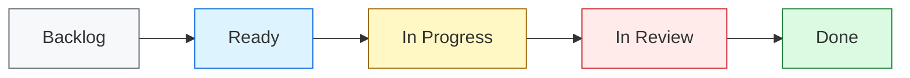
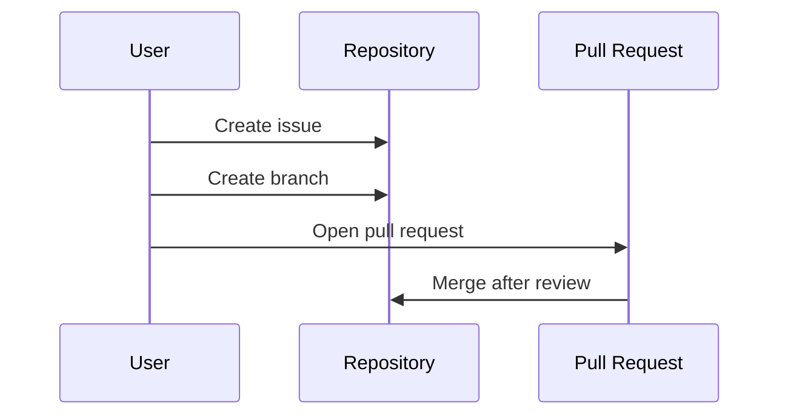

# Mermaid Diagram Guidelines

Use Mermaid diagrams when they make a workflow, architecture, dependency, or decision easier to understand than text alone.

## Supported Diagram Types

Prefer these diagram types:

- `flowchart` for process and architecture flows
- `sequenceDiagram` for interactions over time
- `stateDiagram-v2` for lifecycle states
- `erDiagram` for simple data relationships

## Compatibility Rules

GitHub's Mermaid renderer is stricter than many local preview tools. Follow these rules to avoid diagrams that work locally but fail on GitHub:

- Use `flowchart LR`, `flowchart TD`, `graph LR`, or `graph TD` for flow diagrams.
- Keep node labels on one line.
- Use plain text labels.
- Avoid double quotes in node labels.
- Avoid parentheses, slashes, ampersands, and em dashes in node labels.
- Use inline `style` rules instead of `classDef` and `class`.
- Use edge labels in the `|plain text|` format.
- Keep participant aliases in `sequenceDiagram` simple and free of parentheses or slashes.
- Keep diagrams small enough to review in a pull request.

## Flowchart Example

## Sequence Example

## Review Checklist

Before merging a Markdown change with Mermaid diagrams:

- [ ] Code fences are closed.
- [ ] Diagram renders in GitHub preview.
- [ ] Labels are short and readable.
- [ ] No `classDef` or `class` styling is used.
- [ ] The diagram adds clarity that text alone does not provide.
