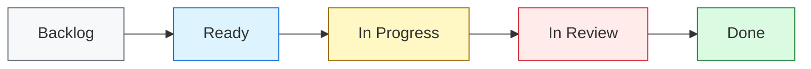

# Project Board Guide

Use a project board to make issue status visible and keep pull requests connected to planned work.

## Recommended Columns

- **Backlog**: captured work that has not been refined.
- **Ready**: work with enough detail to start.
- **In Progress**: work currently being implemented.
- **In Review**: pull request is open and waiting for review.
- **Done**: work is merged or otherwise complete.

## Definition of Ready

An issue is ready when:

- The goal is clear.
- Acceptance criteria or done checks are written.
- Dependencies and blockers are known.
- The issue is small enough to complete in one focused change.

## Definition of Done

An issue is done when:

- Acceptance criteria are met.
- The linked pull request is merged or the work is otherwise complete.
- Documentation is updated if needed.
- Manual checks or tests are documented.

## Labels

Recommended labels:

- `enhancement` for user-facing improvements.
- `bug` for broken or unexpected behavior.
- `technical debt` for maintenance and cleanup.
- `documentation` for documentation-only work.
- `user story` for issues written from a user's perspective.

## Board Flow

## Working Rules

- Start work from an issue, not directly from an idea.
- Keep one issue focused on one outcome.
- Link pull requests to issues with `Closes #issue-number`.
- Move issues across the board as their real status changes.
- Keep blocked work visible and add a comment explaining the blocker.
